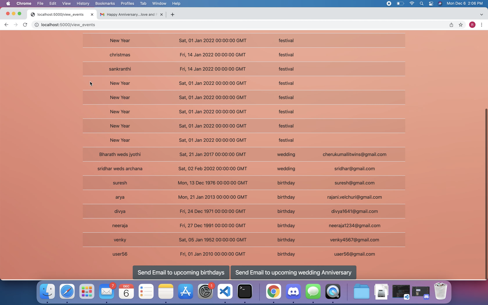
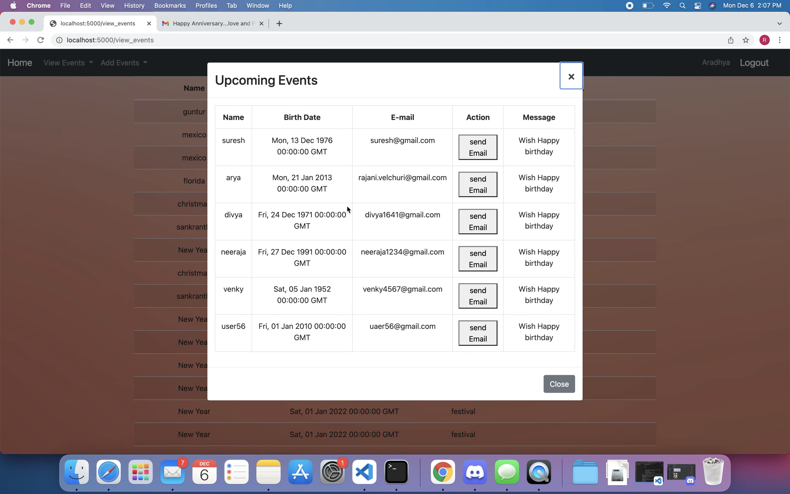

Event Remider is a web application, where you can enter or view event details like Birthdays, wedding, Death Anniversaries, vacations list and festival list. once login to accout user can see the upcoimg event tables,user can send greetings/messages through email for Birthdays and weddings.

    

      
    
    
    

     

        This image shows all event details when user login to the event-reminder.
    

    
 

 
 

       

       
    

    

     
 

    By using Bootstrap and  Ajax dipaying the table for Birthdays and wedding days. user can click on Email button to send messages/gretings through Twilio API

This project mainly built on python, used SQLAlchemy database, flask server, JSON, AJAX, HTML, CSS and bootstrap
Used the Twilio API to send Emails.

<i class="devicon-flask-original iconsize"></i>
<i class="devicon-css3-plain-wordmark colored iconsize" ></i>
<i class="devicon-html5-plain-wordmark colored iconsize"></i>
<i class="devicon-javascript-plain colored iconsize"></i>
<i class="devicon-jquery-plain-wordmark colored iconsize"></i>
<i class="devicon-markdown-original colored iconsize"></i>
<i class="devicon-postgresql-plain-wordmark colored iconsize"></i>
<i class="devicon-python-plain-wordmark colored iconsize "></i>
<i class="devicon-sqlalchemy-original-wordmark colored iconsize"></i>

